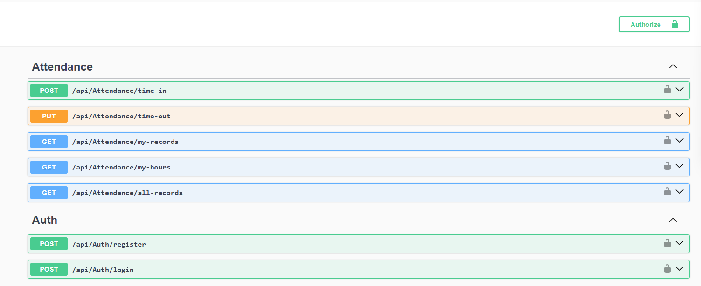

# 📋 Attendance API

A robust backend for an Attendance Tracking System built with **ASP.NET Core**, **Dapper**, and **SQL Server**. This API provides secure user management, time-tracking capabilities, and detailed attendance reports.

---

## 🚀 Features

### 🔐 User Management & Security
- **Secure Authentication**: Implementation of JWT (JSON Web Tokens) for stateless authentication.
- **Identity Protection**: Password hashing using BCrypt for industry-standard security.
- **Account Management**: Simple registration and login flow for users.

### ⏱️ Attendance Tracking
- **Smart Time-In/Out**: Prevent duplicate active sessions and ensure logical flow (must Time-In before Time-Out).
- **Precision Logging**: All logs are handled with standard DateTime precision.
- **Reporting**: Instant calculation of daily, weekly, and monthly work hours.

### 📊 Data & Analytics
- **Personal History**: Users can access their own full history of attendance records.
- **Administrative Overview**: Endpoint available to view global logs for all users.

---

## 🛠️ API Endpoints

### Authentication (`/api/Auth`)
| Method | Endpoint | Description |
| :--- | :--- | :--- |
| `POST` | `/register` | Register a new user account |
| `POST` | `/login` | Authenticate and receive a JWT token |

### Attendance (`/api/Attendance`)
*Requires Bearer Token*
| Method | Endpoint | Description |
| :--- | :--- | :--- |
| `POST` | `/time-in` | Start a new work session |
| `PUT` | `/time-out` | End the current active session |
| `GET` | `/my-records` | Retrieve all attendance logs for the current user |
| `GET` | `/my-hours` | Get work hour stats (Daily/Weekly/Monthly) |
| `GET` | `/all-records` | View all attendance records (Global) |

---

## 📸 Visuals

### API Interface (Swagger UI)


---

## ⚙️ Getting Started

### Prerequisites
- [.NET 8 SDK](https://dotnet.microsoft.com/download/dotnet/8.0)
- SQL Server

### Setup
1. **Clone the repository**:
   ```bash
   git clone <repository-url>
   cd AttendanceAPI
   ```
2. **Configure the Database**:
   Update the connection string in `appsettings.json`:
   ```json
   "ConnectionStrings": {
     "DefaultConnection": "Server=YOUR_SERVER;Database=AttendanceDB;Trusted_Connection=True;"
   }
   ```
3. **Run the Application**:
   ```bash
   dotnet run
   ```
4. **Access Swagger**:
   Open `http://localhost:5000/swagger` (or your configured port) to interact with the API.

---

## 🏗️ Tech Stack
- **Framework**: ASP.NET Core
- **ORM**: Dapper (Micro-ORM)
- **Security**: JWT & BCrypt.Net
- **Documentation**: Swagger/OpenAPI